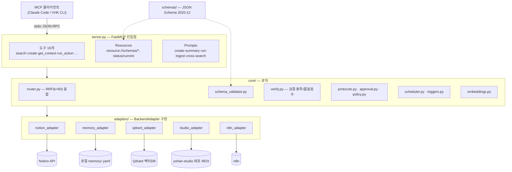

# yohan-mcp

> 5개 백엔드(**Notion·memory·Qdrant·Studio·n8n**)를 하나의 타입 시스템으로 묶는 통합 MCP 서버. "팔란티어 뼈대(타입·라우팅·검증) × SW 3.0 피부(의도 기반 도구·검증 메타)".

한 줄 요약: query 하나로 여러 백엔드를 병렬 검색(**RRF 융합**)하고, 모든 응답에 검증 메타(스키마·품질점수·출처)를 동봉하며, 수집→요약→발행을 **프로토콜 체인**으로 자동화하되 되돌리기 어려운 단계엔 **사람 승인 게이트**를 둔다.

| 무엇을 | 어떻게 |
| --- | --- |
| 통합 검색 | Notion(키워드)+memory(파일)+Qdrant(의미) 병렬 → RRF(k=60) 융합 |
| 타입 안전 | `schemas/`(JSON Schema 2020-12) 로 입력·출력 검증, 6항목 품질점수 |
| 자동화 | 프로토콜 체인 + 정책 기반 자동승인/사람 폴백 + 트리거(cron/webhook) |
| 무설정 시작 | `.env` 없이도 기동 — `memory` 백엔드는 즉시 실동작 |

---

## Quick Start (≈15분)

결론부터: 아래 5단계면 새 머신에서 MCP 서버가 뜬다. `memory` 만 쓸 거면 2·3·4 단계는 건너뛰어도 된다(무설정 동작).

| 단계 | 명령 | 목적 | 필수? |
| --- | --- | --- | --- |
| 1 | `pip install -r requirements.txt` | 의존성 | 필수 |
| 2 | `ollama pull bge-m3` | 임베딩 모델(1024d, 한국어 강함) | 의미검색 시 |
| 3 | `docker compose up -d` | Qdrant 벡터DB(6333) | 의미검색 시 |
| 4 | `copy .env.example .env` | 시크릿·설정 | 선택 |
| 5 | `python server.py` | MCP 서버(stdio) | 필수 |

### 1. 의존성 설치

```powershell
pip install -r requirements.txt
```

Python 3.10+ 권장(`X | None` 타입, `zoneinfo` 사용). `requirements.txt` 는 핀 고정본이다. `sentence-transformers`/`torch` 는 목록에 없다 — 로컬 임베딩(`local` 백엔드)을 쓸 때만 별도 설치하면 된다.

### 2. Ollama 임베딩 모델 (의미검색용)

```powershell
ollama pull bge-m3
```

Qdrant 의미검색은 임베딩이 있어야 의미가 있다. 기본 임베딩 백엔드는 `auto` 로 **ollama → local → hash** 순서로 폴백한다. ollama 가 없거나 모델 미설치면 의존성 0짜리 `hash`(384d) 로 떨어지는데, 이건 파이프라인 동작용일 뿐 의미품질이 낮다. 제대로 된 의미검색을 원하면 `bge-m3`(1024d) 를 깔아라.

### 3. Qdrant (docker-compose)

```powershell
docker compose up -d
```

`docker-compose.yml` 은 Qdrant 컨테이너 하나를 띄운다 — REST `6333`, gRPC `6334`, 영속 볼륨 `./.qdrant_storage`. Docker 가 없으면 QdrantAdapter 가 임베디드 `:memory:` 모드로 자동 폴백하지만, 프로세스 종료 시 휘발하므로 **영속 시딩엔 컨테이너가 필요**하다.

### 4. .env 작성

```powershell
copy .env.example .env
```

`.env.example` 를 복사해 필요한 값만 채운다. **`.env` 는 커밋 금지**(`.gitignore` 대상). 대부분 선택값이라 비워둬도 서버는 뜨고, 미설정 백엔드는 `status` 에서 FAIL/미설정으로 표시된다. 전체 변수는 아래 [환경변수](#환경변수-env) 참조.

### 5. 서버 실행

```powershell
python server.py
```

stdio MCP 서버가 뜬다(stdout=JSON-RPC, stderr=UTF-8 진단). `.env` 없이도 기동되며 `memory` 만 즉시 실동작한다.

MCP 클라이언트(Claude Code 등)에 등록하려면 stdio 서버로 연결한다(표준 MCP 사용법):

```json
{
  "mcpServers": {
    "yohan-mcp": { "command": "python", "args": ["server.py"], "cwd": "C:/Users/Public/dev/yohan-ecosystem/yohan-mcp" }
  }
}
```

### 6. (선택) Qdrant 시딩

```powershell
python scripts/seed_qdrant.py --rebuild --demo   # Notion 없이 내장 RESOURCE 적재
python scripts/seed_qdrant.py --limit 50         # Notion RESOURCE 50건 → 벡터(멱등)
```

임베딩 차원이 바뀌면(hash 384 → ollama 1024) `--rebuild` 로 컬렉션을 재생성해야 한다. 플래그: `--limit N`(건수 제한), `--batch N`(기본 64), `--rebuild`(컬렉션 삭제·재생성), `--demo`(Notion 없이 내장 RESOURCE).

---

## 아키텍처

3계층이다: **server.py**(MCP 노출) → **core/**(로직) → **adapters/**(백엔드 추상화). 타입 정의는 `schemas/` 한 곳에 있고 검증기·MCP Resources 가 그걸 읽는다.



### server.py

FastMCP 진입점. **도구 16개 + Resources + Prompts** 를 등록한다. import 시점에 `ToolContext.from_env()` 로 어댑터·라우터·검증기를 한 번 구성하고, lifespan 종료 때 httpx 클라이언트를 정리한다. 런타임 경로에서 `stdout` 으로 print 금지(JSON-RPC 프레이밍 오염) — 진단은 `stderr`(UTF-8) 로만 나간다.

### core/

| 모듈 | 역할 |
| --- | --- |
| `tools.py` | 도구 16개 로직 + `ToolContext`(어댑터·라우터·검증기·저장소 묶음) |
| `router.py` | Smart Router — 백엔드 선택 → 병렬 search → **RRF(k=60)** 융합. 백엔드 장애·미구현 격리 |
| `schema_validator.py` | `schemas/` 로딩(상대 `$ref` 해소) + `validate`/`validate_partial`/`backend_of` |
| `verify.py` | Verifiability Engine — 표준 검증 봉투 + 6항목 품질점수 |
| `protocols.py` | Protocol Engine — 멀티스텝 체인(`ingest_summarize_publish` 등) |
| `approval.py` | 승인큐(L2 게이트) — `approvals.jsonl` |
| `policy.py` | 정책 엔진(L3 자동승인/사람 폴백) + 감사 로그 |
| `scheduler.py` | 트리거 정의 로더 + `run_trigger` 진입점(수동) |
| `triggers.py` | TriggerEngine — due `tick()` 발화 + webhook HMAC(무인 구동) |
| `embeddings.py` | 임베딩 추상화(ollama/local/openai/hash) |
| `links.py` | 인스턴스 링크 저장소(`published_as` 등 런타임 JSONL) |
| `paths.py` | 경로 해소 — yohan-brain memory SoT vs MCP 런타임 저널 분리 |

### adapters/

모든 백엔드는 `adapters/base.py` 의 `BackendAdapter` ABC(`search`/`create`/`update`/`health_check`)를 구현한다. 단위 반환은 표준 레코드 `{id, type, backend, score, data}`.

| 어댑터 | 백엔드 | 상태 |
| --- | --- | --- |
| `notion_adapter` | Notion API v1 | 실동작 — `NOTION_TOKEN` 없으면 create 가 드라이런 폴백 |
| `memory_adapter` | 로컬 `memory/`(yaml) | 실동작 — 무설정(profile/decision/ingest CRUD) |
| `qdrant_adapter` | Qdrant 벡터DB | 실동작 — `QDRANT_URL` 없으면 `:memory:` 폴백 |
| `studio_adapter` | yohan-studio 레포(MDX) | 실동작 — 기본 `dry_run`(파일 미작성) |
| `n8n_adapter` | n8n | `health_check` 만(search/create 미구현) |

### 검색·융합 (RRF)

`search`/`get_context` 는 라우터가 활성 백엔드를 골라 병렬 호출한 뒤 **RRF(k=60)** 로 순위 융합한다. 융합 키는 `타입::id` 라 서로 다른 엔티티를 오융합하지 않는다. Qdrant 는 쓰기 컬렉션(`yohan_resources`)에 더해 **yohan-control-tower 의 읽기전용 4컬렉션**(`knowledge_base`·`system_rules`·`semantic_cache`·`execution_history`, 동일 bge-m3 1024d)까지 검색한다. `QDRANT_SEARCH_COLLECTIONS`(CSV) 로 덮어쓸 수 있다.

---

## 데이터 모델 (schemas/)

`schemas/` 는 **VHK CLI 와 yohan-mcp 가 공유하는 코어**다. 모든 스키마는 JSON Schema **draft 2020-12** 이며, SW 3.0 원칙에 따라 모든 필드에 한국어 `description` 과 `examples` 를 둬서 에이전트가 스키마만 읽고 데이터를 생성할 수 있다. **스키마 11종**(Notion 5 + memory 3 + Studio 2 + 공유 enum 1)과 크로스 백엔드 관계 `_links.json`.

```
yohan-mcp/
├─ server.py                      # MCP 진입점(FastMCP) — 도구 16 + Resources + Prompts
├─ core/                          # 로직(라우터·검증·프로토콜·정책·트리거·임베딩)
├─ adapters/                      # 백엔드별 BackendAdapter 구현 5종
├─ schemas/                       # 타입 시스템(JSON Schema 2020-12)
│  ├─ _shared-enums.json          # 공유 enum($defs: Status·Domain·… )
│  ├─ _links.json                 # 크로스 백엔드 관계 7종
│  ├─ notion/                     # resource·summary·triple·ai-dict·execution-log
│  ├─ memory/                     # profile·decision·ingest
│  └─ studio/                     # post·product
├─ triggers.json                  # 트리거 정의(스키마 불변, 커밋)
├─ docker-compose.yml             # Qdrant 로컬 인프라
└─ scripts/
   ├─ validate_schemas.py         # 스키마·문서·링크 정합성 검증
   └─ seed_qdrant.py              # RESOURCE → 벡터 시딩(멱등)
```

### 크로스 백엔드 관계 (`_links.json`)

노드 형식은 `<backend>:<entity>`(`notion:*` 는 와일드카드). 검증기가 FK 무결성(`cross_links_intact`)을 이 맵으로 판정한다. 타입 수준 관계맵은 **불변**이고, `published_as` 같은 개별 인스턴스 관계는 런타임 `links.jsonl` 에 따로 적재된다.

| source | target | relation | cardinality |
| --- | --- | --- | --- |
| notion:resource | notion:summary | summarized_by | 1:N |
| notion:summary | memory:decision | triggers_decision | 1:N |
| notion:resource | qdrant:embedding | has_vector | 1:1 |
| notion:summary | studio:post | published_as | 1:N |
| notion:summary | notion:ai-dict | promoted_to | 1:N |
| notion:triple | notion:* | connects | N:N |
| memory:ingest | notion:resource | ingested_from | 1:1 |

### 검증

```powershell
python scripts/validate_schemas.py
```

검사: ① 모든 `*.schema.json` 이 draft 2020-12 메타스키마로 유효 ② 최상위 `title`·`description` 및 모든 property 의 `description`·`examples` 완비 ③ 공유 enum `$defs` 문서화 ④ `_links.json` 노드가 실재 스키마(또는 허용된 외부 백엔드)를 가리킴.

---

## 도구 (16개)

모든 도구는 표준 검증 봉투(아래 [응답 봉투](#응답-봉투-verifiability))로 응답한다. 예외는 전부 `{errors}` 로 격리해 MCP 를 죽이지 않는다.

| 도구 | 하는 일 |
| --- | --- |
| `search(query, opts?)` | 여러 백엔드 병렬 조회 → RRF 융합 |
| `create(type, data)` | 타입 보고 백엔드 자동선택 + 스키마 검증 후 생성(미설정이면 드라이런) |
| `update(id, data, type?)` | id 엔티티 부분 갱신(타입 주면 부분 검증) |
| `get_context(query, opts?)` | 질의 관련 엔티티 + `_links` 관계 수집 |
| `status()` | 5개 백엔드 health 한 줄 요약 |
| `run_action(action, params?)` | 프로토콜(순차 step 체인) 실행 — 게이트면 `run_id` pending 반환 |
| `approve(run_id, decision, note?)` | 승인 게이트 결정(approve→재개 / reject→종료) |
| `run_trigger(trigger_id, params?)` | 트리거 정의를 정책 경유로 실행(수동 진입점) |
| `list_triggers()` | 등록 트리거 카탈로그(읽기 전용) |
| `fire_due_triggers()` | due 인 interval/daily 트리거 1회 tick(무인 발화) |
| `webhook(body, signature?)` | 웹훅 수신 — HMAC 검증 후 매핑 트리거 발화 |
| `policy()` | 현재 정책 + 오늘 자동발행 수(읽기 전용) |
| `publish(summary)` | SUMMARY → Studio 블로그 MDX 발행(기본 드라이런) |
| `ingest(source, data?)` | URL 수집 → Notion+Qdrant+memory 3중 적재 |
| `plan(goal, opts?)` | 목표 → 적합 프로토콜 추천 + step 미리보기(dry plan) |
| `check(type, data?)` | 데이터를 스키마로 검증 + 6항목 품질점수(`data` 없으면 타입 목록) |

### Resources / Prompts

에이전트가 직접 읽는 MCP Resources: `resource://schemas/{backend}/{entity}`(스키마 원문+examples), `resource://schemas/_links`(관계맵), `resource://schemas/_index`(타입 색인), `resource://status/current`(실시간 상태). few-shot Prompts: `create-summary`·`run-ingest`·`cross-search`.

---

## 응답 봉투 (Verifiability)

모든 도구는 같은 봉투를 돌려준다 — 결과(data)에 검증(verification)과 출처(provenance)를 동봉한다.

```jsonc
{
  "data": { /* 도구별 본문 */ },
  "diff": { "before": null, "after": { /* 변경 도구만 */ } },
  "verification": {
    "schema_valid": true,            // 스키마 통과 (미검증이면 null)
    "rulebook_pass": true,           // 비즈니스 규칙 통과
    "cross_links_intact": true,      // FK 가 _links 관계와 정합
    "contradiction_detected": false, // 결정적 모순 규칙
    "quality_score": 6               // 0~6 (집계/조회 도구는 null)
  },
  "provenance": { "sources_used": ["notion", "memory", "qdrant"], "reasoning_steps": ["…"] },
  "errors": []                       // 격리된 백엔드 오류(있을 때)
}
```

품질점수 6항목: `schema_valid`·`required_present`·`enums_valid`·`provenance_present`·`timestamps_valid`·`content_nonempty`. `check` 도구가 이 6항목을 직접 반환한다. `errors` 형태는 도구마다 다르다 — 엔티티 도구(create/update/ingest 등)는 **리스트**, `search`/`get_context` 는 `{백엔드: 사유}` **dict**.

### get_context 응답 스키마

`get_context(query, opts?)` 는 질의로 검색한 엔티티(`matches`)와 그 타입에 걸린 `_links` 관계(`related_links`)를 함께 준다. `data` 외 필드는 위 표준 봉투와 같다.

```jsonc
{
  "data": {
    "matches": [                     // RRF 융합 레코드(rrf_score 내림차순)
      {
        "id": "res_ab12cd34",        // 엔티티 PK
        "type": "resource",          // 스키마 키
        "backend": "notion",         // 출처 백엔드
        "data": { /* 해당 스키마로 검증 가능한 본문 */ },
        "rrf_score": 0.0163,         // RRF 융합 점수 = Σ 1/(k+rank)
        "sources": ["notion", "qdrant"]  // 이 엔티티를 반환한 백엔드들
      }
    ],
    "related_links": [               // matches 의 타입에 걸린 _links 관계
      { "source": "notion:resource", "target": "notion:summary",
        "relation": "summarized_by", "cardinality": "1:N", "description": "…" }
    ],
    "count": 1                       // matches 개수
  },
  "verification": { "schema_valid": true, "rulebook_pass": true,
                    "cross_links_intact": true, "contradiction_detected": false,
                    "quality_score": null },
  "provenance": { "sources_used": ["notion", "memory", "qdrant"] },
  "errors": {}                       // {백엔드: 사유} dict — 실패 없으면 {}
}
```

`matches` 는 라우터가 RRF 로 융합한 레코드(`core/router.py` — 어댑터의 `score` 대신 `rrf_score`·`sources` 를 가짐), `related_links` 항목 형식은 `schemas/_links.json` 의 관계 정의를 그대로 따른다. `get_context` 는 조회 도구라 `quality_score` 는 `null`(비적용)이다.

---

## 트리거 (자동화)

트리거는 **언제·무엇을·어떤 정책으로** 돌릴지 `triggers.json` 에 선언한다(스키마 불변, 리포 커밋). 정의는 커밋하고 실행 상태/이력/락은 런타임 디렉토리(gitignore)에 둔다. 구동 방식 둘:

- **cron 계열**(interval/daily): `fire_due_triggers()` 가 due 트리거를 `tick` 으로 발화. cron 풀파서는 없고 `every_sec`/`at`(HH:MM)/cron 부분집합 `"M H * * *"` 만 지원.
- **webhook**: `webhook(body, signature)` 가 HMAC-SHA256(`WEBHOOK_SECRET`)을 검증한 뒤 매핑 트리거 발화. 서명 누락/불일치는 401, 동일 `event_id` 재전송은 1회만(멱등).

안전장치(외부 브로커 0, 전부 로컬 JSONL/락): `run_key` 멱등 · watermark 증분 · single-flight 락 · 실패 격리 · 지수 백오프. **외부 실발행(publish)은 무인 발화여도 자동 금지** — 트리거 정책이 `require_approval` 이면 승인 큐 폴백(드라이런)까지만 가고, 명시 승인 통과 시에만 실발행한다.

### triggers.json 스키마

| 필드 | 값 | 설명 |
| --- | --- | --- |
| `id` | 문자열(필수) | 트리거 고유 ID |
| `type` | `interval`·`daily`·`webhook`·`manual` | 트리거 종류(신). 레거시 `kind`: `cron`·`webhook`·`manual` |
| `enabled` | 불리언(기본 true) | 비활성화 스위치 |
| `schedule` | interval=`{every_sec}` · daily=`{at:"HH:MM", tz?}` 또는 cron `"M H * * *"` | 발화 주기 |
| `target` | `{chain, params?}` | 실행 대상(신). 레거시: `protocol` + `params` |
| `event` | `{name}` | webhook 매핑 이벤트명 |
| `policy` | `{require_approval}` 또는 `{auto_approve_when[], always_gate[], max_publishes_per_day}` | 게이트 정책 |
| `params` | 객체 | 프로토콜 입력 |
| `desc` | 문자열 | 설명 |

`chain` 값: `full_loop`(=`ingest_summarize_publish`) · `ingest_summarize`(수집→요약, 발행 없음) · 등록 프로토콜명(`resource_to_decision`).

### cron 예시 (interval / daily)

```jsonc
{
  "id": "hourly_ingest",
  "type": "interval",
  "enabled": true,
  "schedule": { "every_sec": 3600 },
  "target": { "chain": "ingest_summarize", "params": { "url": "https://example.com/feed" } },
  "desc": "매시간 수집→요약(발행 없음, 무인 자동)"
}
```

```jsonc
{
  "id": "nightly_full_loop",
  "type": "daily",
  "enabled": true,
  "schedule": { "at": "02:30", "tz": "Asia/Seoul" },
  "target": { "chain": "full_loop", "params": { "url": "https://example.com/nightly" } },
  "policy": { "publish_mode": "dry_run", "require_approval": true },
  "desc": "매일 02:30 수집→요약→발행 진입. 발행은 승인 큐 폴백까지만"
}
```

### webhook 예시

```jsonc
{
  "id": "strict_publish",
  "type": "webhook",
  "enabled": true,
  "event": { "name": "publish_request" },
  "target": { "chain": "full_loop" },
  "policy": { "auto_approve_when": [], "always_gate": ["is_publish"], "max_publishes_per_day": 0 },
  "desc": "웹훅(event=publish_request) — HMAC 검증 후 발화, 모든 발행 사람 승인"
}
```

호출 측은 본문을 `WEBHOOK_SECRET` 으로 HMAC-SHA256 서명해 `signature`(`sha256=...` 접두 허용)로 보낸다. payload 는 `{ "event": "publish_request", "event_id": "...", "params": { ... } }`.

### 자율성 레벨

| 레벨 | 의미 | yohan-mcp |
| --- | --- | --- |
| L1 | 단발 도구 실행 — 사람이 매 호출 지시 | `search`/`create`/`publish`/`ingest`… |
| L2 | 프로토콜 체인 + 되돌리기 어려운 step 직전 사람 승인 게이트 | `run_action` → [GATE] → `approve` |
| L3(코드) | 정책 기반 자동승인 — 한도 내 무인, 초과/위험은 사람 폴백 | `policy` + 트리거 정책 |
| L3(구동) | cron/webhook 상시 트리거 | `fire_due_triggers`/`webhook` |

기본 정책은 **보수적(opt-in)** 이다 — 자동승인 없음(P4 동등). 무인 자동화는 트리거 정책이나 호출자가 명시 채택할 때만 켜지고, 모든 자동 결정은 감사 로그(`policy_log.jsonl`)에 남는다.

---

## 환경변수 (.env)

전부 `.env.example` 를 복사해서 채운다. 아래는 코드에서 실제 읽는 변수 전부다. **실제 시크릿은 커밋 금지.**

### Notion

| 변수 | 기본 | 설명 |
| --- | --- | --- |
| `NOTION_TOKEN` | (없음) | Notion API 토큰. 없으면 `create` 가 드라이런 폴백 |
| `NOTION_RESOURCE_DB_ID` | (없음) | RESOURCE DB ID |
| `NOTION_SUMMARY_DB_ID` | (없음) | SUMMARY DB ID |
| `NOTION_TRIPLE_DB_ID` | (없음) | 지식 트리플 DB ID |
| `NOTION_AIDICT_DB_ID` | (없음) | AI 사전 DB ID |
| `NOTION_EXECLOG_DB_ID` | (없음) | EXECUTION LOG DB ID |

### Qdrant / 임베딩

| 변수 | 기본 | 설명 |
| --- | --- | --- |
| `QDRANT_URL` | (없음→`:memory:`) | 예: `http://localhost:6333` |
| `QDRANT_COLLECTION` | `yohan_resources` | 쓰기 컬렉션 |
| `QDRANT_SEARCH_COLLECTIONS` | (쓰기+관제탑 4) | 검색 대상 컬렉션 CSV override |
| `EMBED_BACKEND` (구 `EMBEDDING_BACKEND`) | `auto` | `auto`·`ollama`·`local`·`openai`·`hash` |
| `EMBEDDING_MODEL` | 백엔드별 상이 | ollama=`bge-m3`, openai=`text-embedding-3-small`, local=`paraphrase-multilingual-MiniLM-L12-v2` |
| `OLLAMA_URL` | `http://localhost:11434` | ollama 서버 |
| `OPENAI_API_KEY` | (없음) | `openai` 임베딩 백엔드용 |

### Studio (발행)

| 변수 | 기본 | 설명 |
| --- | --- | --- |
| `STUDIO_REPO_PATH` | (없음) | yohan-studio 레포 경로(발행 대상). 없으면 드라이런 |
| `STUDIO_PUBLISH_MODE` | `dry_run` | `dry_run`(파일 미작성)·`file`(쓰기)·`pr`(브랜치+PR). file/pr 은 always_gate |
| `STUDIO_PUBLISH_SUBDIR` | `src/content/blog` | MDX 발행 서브경로 |
| `STUDIO_BASE_BRANCH` | `master` | PR 모드 base 브랜치 |
| `STUDIO_API_URL` / `STUDIO_API_KEY` | (없음) | health_check 연결 점검용(발행은 MDX 파일) |

### 기타 / 인프라

| 변수 | 기본 | 설명 |
| --- | --- | --- |
| `N8N_URL` | (없음) | n8n 베이스 URL(health_check용) |
| `WEBHOOK_SECRET` | (없음) | 웹훅 HMAC 시크릿. 없으면 webhook 401 |
| `HEADROOM_URL` | (없음) | 압축 프록시 URL. 설정 시 `status` 가 헬스 한 줄 추가 |
| `MEMORY_DIR` | `<repo>/memory` | memory SoT 경로 override(최우선) |
| `YOHAN_BRAIN_ROOT` | (없음) | 설정 시 memory = `<root>/memory`(yohan-brain SoT 연동) |
| `MCP_RUNTIME_DIR` | 자동 | 런타임 JSONL 저널 경로. brain 연동 시 `memory/ops/mcp-runtime` 로 격리 |

> 경로 규칙(`core/paths.py`): memory(지식 SoT)는 `MEMORY_DIR` > `YOHAN_BRAIN_ROOT/memory` > `<repo>/memory` 순으로 해소. 운영 저널(runs/approvals/created/links/policy 등)은 brain 연동 시 `ops/mcp-runtime` 하위로 분리해 지식과 섞이지 않게 한다.

---

## Docker / 인프라

`docker-compose.yml` 은 Qdrant 컨테이너 하나다.

```powershell
docker compose up -d        # Qdrant 기동(REST 6333 / gRPC 6334, 볼륨 ./.qdrant_storage)
docker compose ps           # 상태 확인
docker compose down         # 정지(볼륨 유지)
```

- Docker 없으면 QdrantAdapter 가 임베디드 `:memory:` 로 자동 폴백한다 — **단, 휘발성**(프로세스 종료 시 소실)이라 영속 시딩엔 컨테이너가 필요하다.
- **Ollama 는 compose 에 없다** — 별도로 설치하고 `ollama pull bge-m3` 로 모델만 받으면 된다(기본 `http://localhost:11434`).
- 기동 후 `status` 도구로 5개 백엔드 + (설정 시) headroom 헬스를 한 번에 확인한다.

---

## 테스트

```powershell
python -m pytest -q                  # 전체 테스트
python scripts/validate_schemas.py   # 스키마 정합성
```

> 테스트는 `python -m pytest` 로 실행한다. ROOT 회귀는 수정돼 수집은 정상(153 collected)이다. 단 E4-01 SoT 리팩터로 `run_action`/approval 영속화 경로 테스트 일부가 실패하는 선재 이슈(이번 변경과 무관)가 있어 이슈 #7에서 추적 중이다. 통과 개수는 직접 실행해 확인해라.
